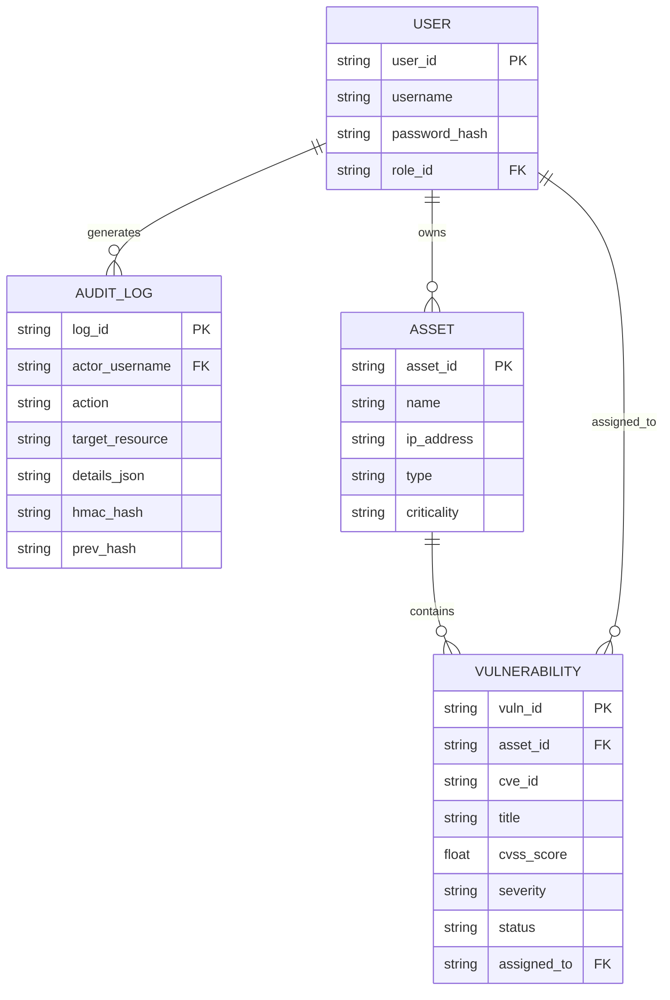
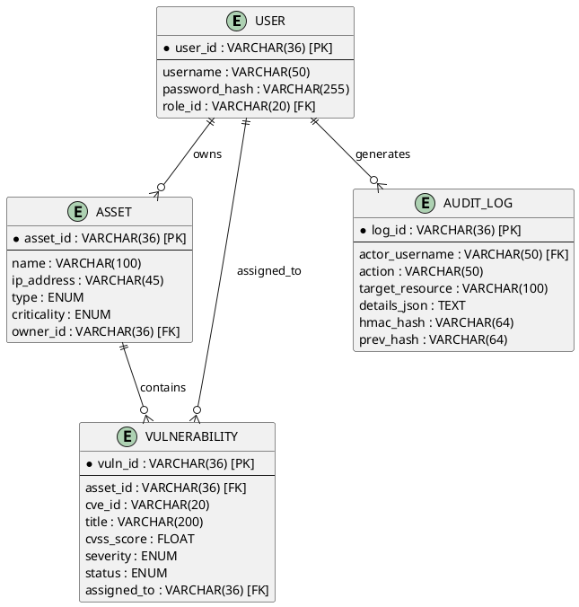
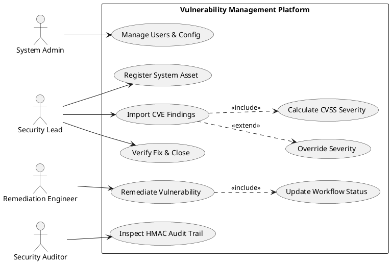
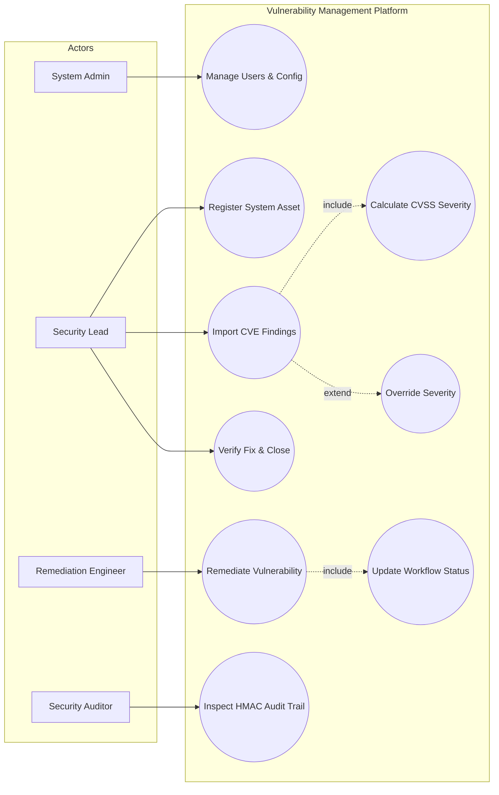
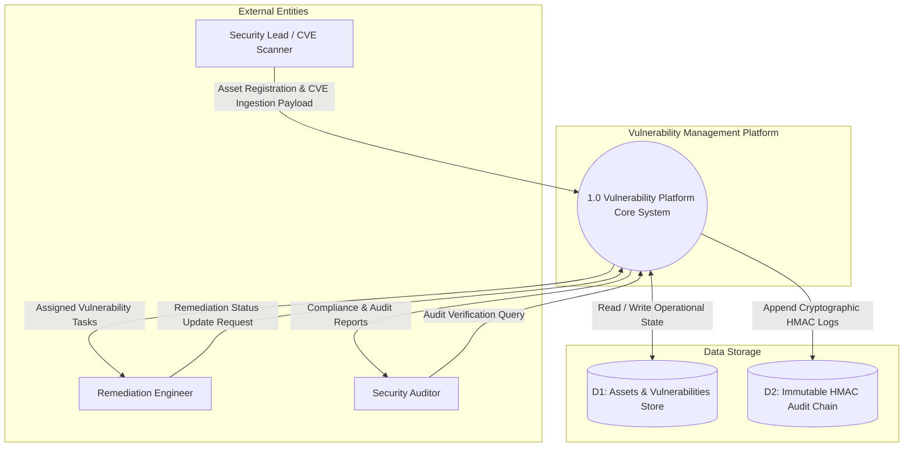
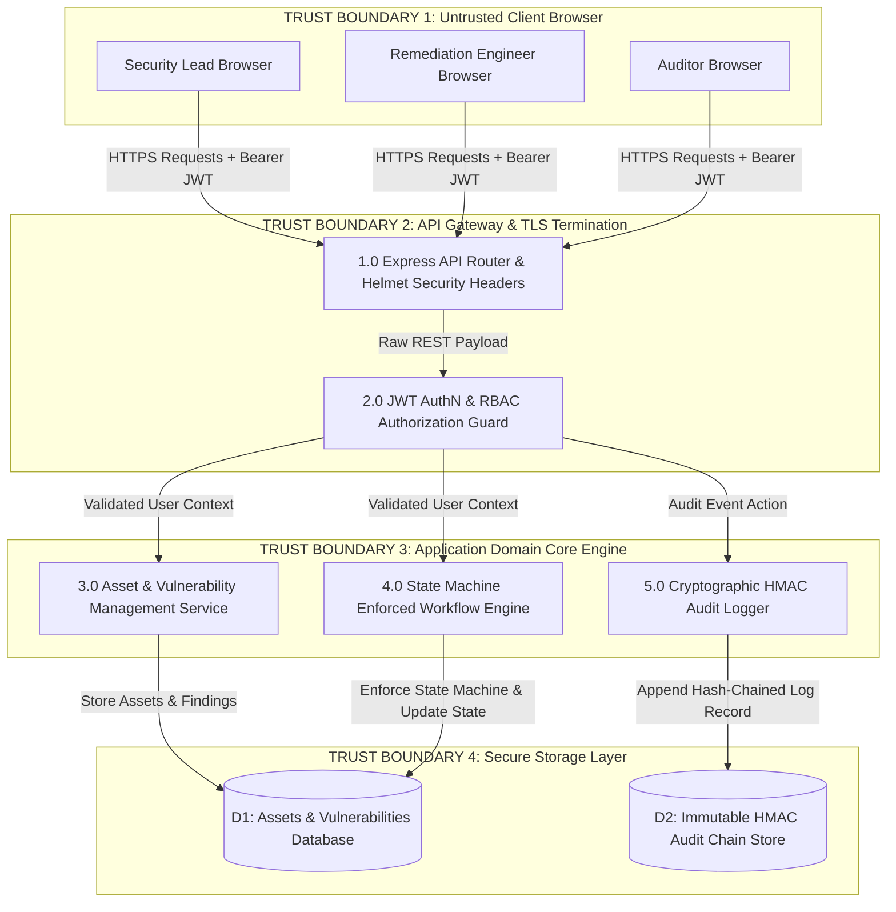
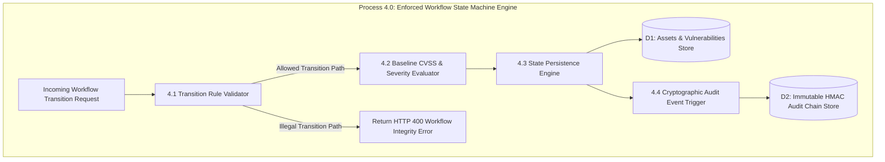
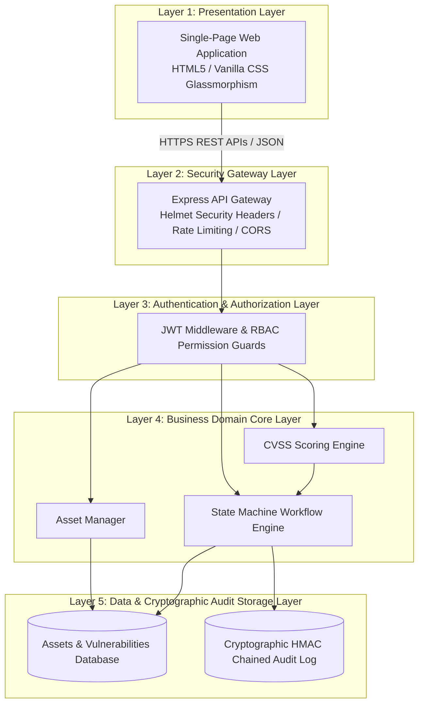

# Vulnerability Management Platform - Diagram Codes for Draw.io

This single file contains the complete code for all **6 required system diagrams** in both **Mermaid** and **PlantUML** formats.

## How to render these in Draw.io (https://app.diagrams.net):
1. Open **[draw.io](https://app.diagrams.net)**.
2. In the menu, go to: **`Arrange`** $\rightarrow$ **`Insert`** $\rightarrow$ **`Advanced`** $\rightarrow$ **`Mermaid`** (or **`PlantUML`**).
3. Copy any code block below and paste it into the draw.io text window.
4. Click **`Insert`** — draw.io will instantly generate the visual diagram image!

---

## 1. Entity-Relationship Diagram (ERD)

### Mermaid Code

### PlantUML Code

---

## 2. UML Use Case Diagram

### PlantUML Code

### Mermaid Code

---

## 3. Data Flow Diagram - Level 0 (Context Diagram)

### Mermaid Code

---

## 4. Data Flow Diagram - Level 1 (with 4 Trust Boundaries)

### Mermaid Code

---

## 5. Data Flow Diagram - Level 2 (Decomposition of Process 4.0: Workflow Engine)

### Mermaid Code

---

## 6. Software Architecture Diagram

### Mermaid Code

